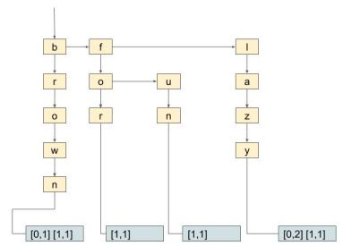

# MiniSearch

Mini search engine for keywords in files. Sentences are considered as documents (big in size).
Each document has the appropriate number starting from 0.

<b><i> Arguments: </i></b>  
./minisearch -i docfile -k K   
./minisearch -i docfile (default value 10 gia to K)   
./minisearch -k K -i docfile   

<b><i> Commands: </i></b>  
<b>/search q1, q2 .. q10</b> (search 1 to 10 words)  
<b>/df</b>                   (document frequency of all words)  
<b>/df q1</b>                (document frequency of specific word)  
<b>/tf</b>                   (term frequency)  

The score of each document was calculated using [bm25](https://en.wikipedia.org/wiki/Okapi_BM25)

The trie structure can be seen in the image below

